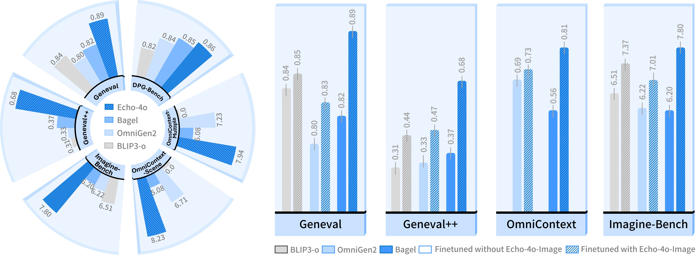

# Echo-4o: Harnessing the Power of GPT-4o Synthetic Images for Improved Image Generation

## 📰 News

* **[2025.8.13]**  🔥 We have released **Echo-4o: Harnessing the Power of GPT-4o Synthetic Images for Improved Image Generation**. Check out the **[** [Paper](https://arxiv.org/pdf/2504.02782); [Dataset](https://huggingface.co/datasets/Yejy53/Echo-4o-Image); [Code](https://github.com/yejy53/Echo-4o/edit/main/README.md) **]**. 

## 🏆 Contributions

* ⁉️ **Why use synthetic data instead of real-world data?:** We analyze and summarize the advantages of synthetic data over real-world images, highlighting its ability to generate rare scenarios and to provide pure, long-tailed supervision for instruction-following tasks.
* 🔧 **How to generate synthetic data?**  We curate **Echo-4o-Image**, a synthetic dataset of ~180K samples generated using GPT-4o. Echo-4o-Image includes 38K surreal fantasy samples, 73K multi-reference image generation samples, and 68K complex instruction-following samples.
* ✨ **Does synthetic data work?** We fine-tune the Bagel model on Echo-4o-Image, yielding model **Echo-4o**, which achieves state-of-the-art performance across multiple benchmarks. Furthermore, Echo-4o-Image consistently enhances other backbone models such as OmniGen2 and BLIP3-o, demonstrating strong transferability.
* 📐 **How to evaluate performance?** We propose two new evaluation benchmarks: **Geneval++** increases instruction complexity to alleviate score saturation in text-to-image evaluation. **Imagine-Bench** targets fantasy tasks and is designed to assess both understanding and generation of imaginative content.

## 🤖 Echo-4o

## 📏 Geneval++
